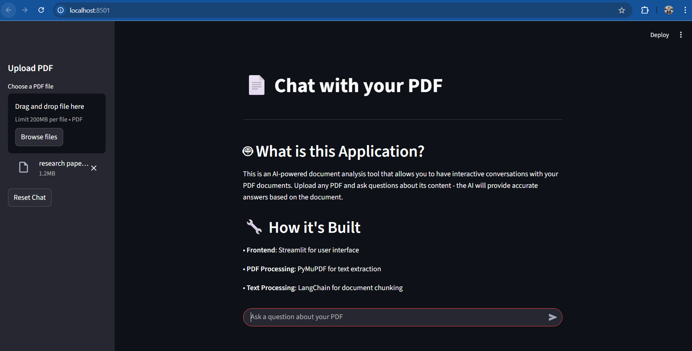
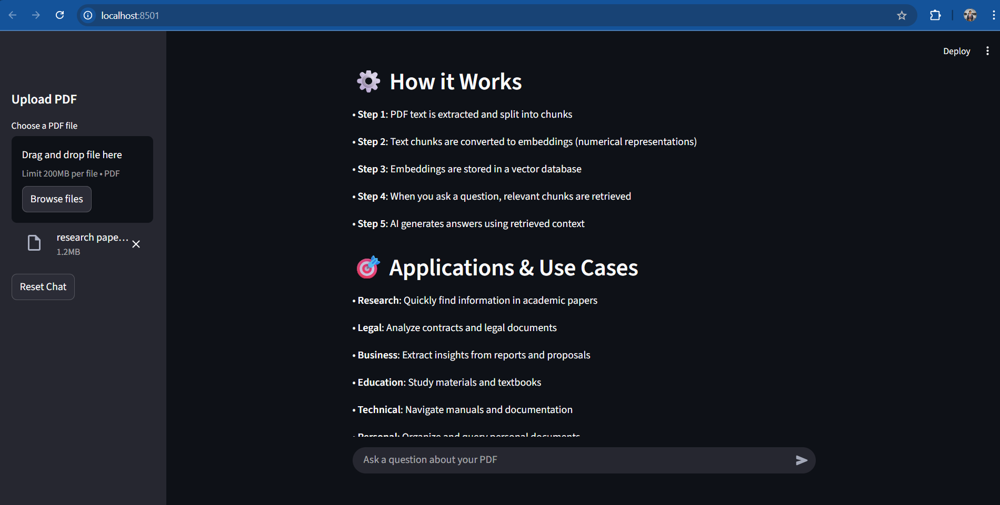
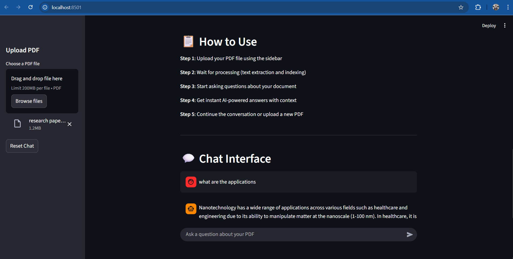

# 📄 Chat with your PDF

An AI-powered document analysis tool that allows you to have interactive conversations with your PDF documents using local models.

## 🚀 Features

- Upload PDF files and chat with their content
- Local processing - no cloud services required
- Fast responses using optimized models
- RAG (Retrieval Augmented Generation) architecture
- Clean and intuitive Streamlit interface

## 🛠️ Installation & Setup

### Prerequisites

1. **Python 3.8+** installed on your system
2. **Ollama** installed locally

### Step 1: Install Ollama

1. Download Ollama from [https://ollama.ai](https://ollama.ai)
2. Install it on your system
3. Pull the required model:
   ```bash
   ollama pull phi3:mini
   ```

### Step 2: Clone/Download the Project

```bash
git clone <your-repo-url>
cd "Project 4 - Chat With Your PDF"
```

### Step 3: Create Virtual Environment

```bash
python -m venv venv
```

### Step 4: Activate Virtual Environment

**Windows:**
```bash
venv\Scripts\activate
```

**macOS/Linux:**
```bash
source venv/bin/activate
```

### Step 5: Install Dependencies

```bash
pip install streamlit langchain langchain-community langchain-text-splitters langchain-core pymupdf chromadb sentence-transformers ollama
```

Or using requirements.txt:
```bash
pip install -r requirements.txt
```

### Step 6: Run the Application

```bash
streamlit run chat_with_pdf.py
```

The application will open in your browser at `http://localhost:8501`

## 📋 Usage

1. **Upload PDF**: Use the sidebar to upload your PDF file
2. **Wait for Processing**: The app will extract and index the text
3. **Start Chatting**: Ask questions about your document
4. **Get Answers**: Receive AI-powered responses based on the PDF content

## 🔧 Tech Stack

- **Frontend**: Streamlit
- **PDF Processing**: PyMuPDF
- **Text Processing**: LangChain
- **Embeddings**: HuggingFace all-MiniLM-L6-v2
- **Vector Database**: Chroma
- **AI Model**: Ollama with Phi3-mini
- **Architecture**: RAG (Retrieval Augmented Generation)

## 🎯 Use Cases

- Research papers analysis
- Legal document review
- Business report insights
- Educational material study
- Technical documentation navigation
- Personal document organization

**Screen Shots:**





## 🐛 Troubleshooting

**Ollama Connection Error:**
- Ensure Ollama is installed and running
- Try restarting Ollama: `ollama serve`
- Verify model is pulled: `ollama list`

**Slow Responses:**
- The phi3:mini model is optimized for speed
- Reduce chunk size in code if needed
- Ensure sufficient system resources

**PDF Processing Issues:**
- Ensure PDF contains extractable text (not scanned images)
- Try with different PDF files
- Check the preview chunk to verify extraction

## 📝 Requirements

```
streamlit
langchain
langchain-community
langchain-text-splitters
langchain-core
pymupdf
chromadb
sentence-transformers
ollama
```

## 🤝 Contributing

Feel free to submit issues and enhancement requests!

## 📄 License

This project is open source and available under the [MIT License](LICENSE).